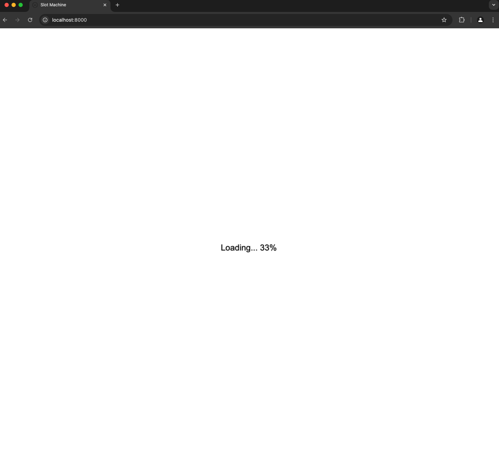
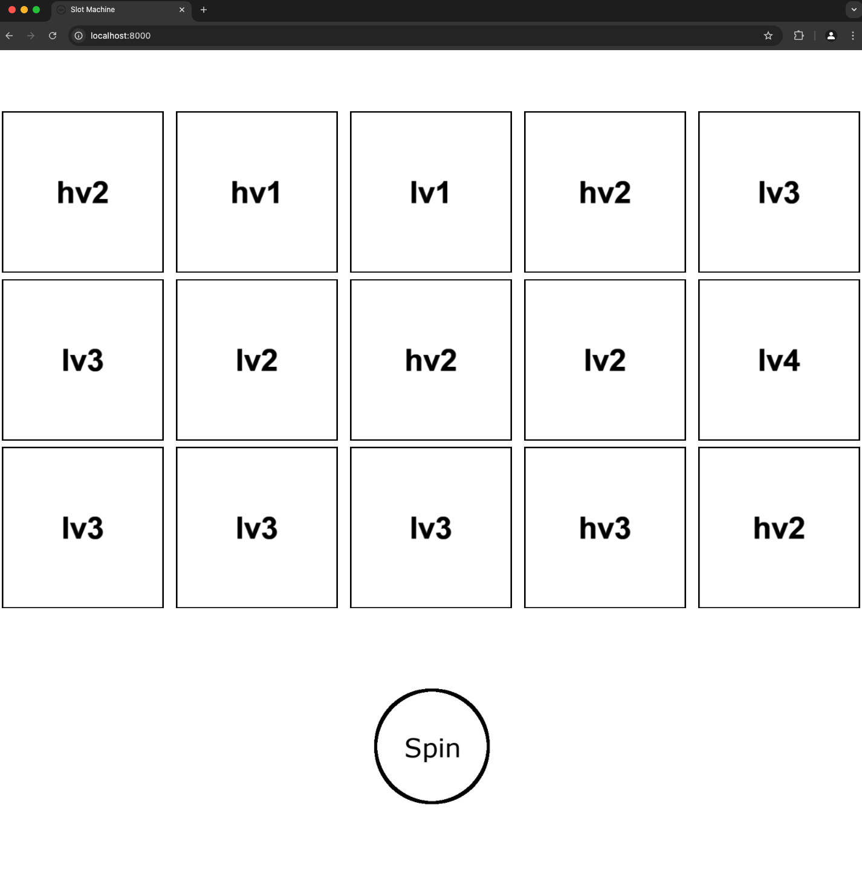
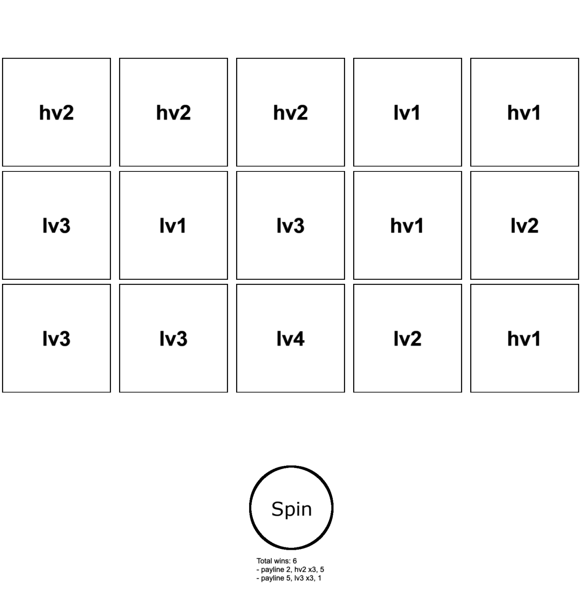
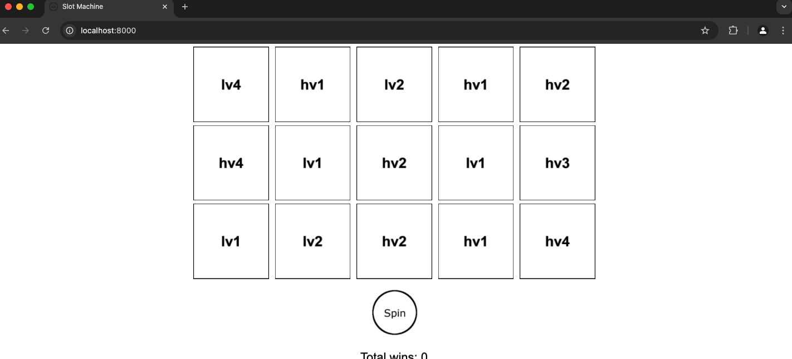
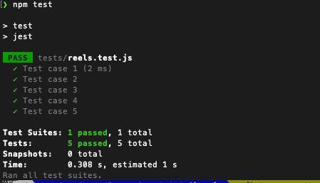

# Slot Machine Game

This project is a basic slot machine game implemented in  Pixi.js. The game displays a 5-column by 3-row reel set, a spin button, and a text area to display winnings. The game area resizes with window resizes, and all game elements are centered on the screen.

## Table of Contents

- [Installation](#installation)
- [Usage](#usage)
- [Game Features](#game-features)
- [Winnings Calculation](#winnings-calculation)
- [Testing](#testing)
- [Visuals](#visuals)

## Installation

To run this project locally, please follow these steps:

1. Install the dependencies:
   ```sh
   npm install
   ```

2. Start the development server:
   ```sh
   python -m http.server 8000
   ```

3. Open your browser and navigate to `http://localhost:8000`.

## Usage

- The game starts with the initial reel positions set to `[0, 0, 0, 0, 0]`.
- Click the spin button to randomly generate new reel positions.
- The winnings will be calculated based on the paytable and paylines mentioned in the programming exercise and the result will be displayed below the spin button.

## Game Features

- **Resizing**: The game area resizes with the window and keeps all elements centered.
- **Preloader**: Displays the loading progress of assets in a centered text. NOTE: The loading process is intentionally slowed to enable viewing the loading progress. This can be changed in the file `src/loader.js`.
- **Spin Button**: A clickable button to spin the reels.
- **Win Display**: A multiline text area to display the total wins and detailed win information.

## Winnings Calculation

The winnings are calculated based on the following paytable:

| Symbol ID | 3 of a Kind | 4 of a Kind | 5 of a Kind |
|-----------|-------------|-------------|-------------|
| hv1       | 10          | 20          | 50          |
| hv2       | 5           | 10          | 20          |
| hv3       | 5           | 10          | 15          |
| hv4       | 5           | 10          | 15          |
| lv1       | 2           | 5           | 10          |
| lv2       | 1           | 2           | 5           |
| lv3       | 1           | 2           | 3           |
| lv4       | 1           | 2           | 3           |

The pay lines always pay from left to right, starting on the first, left-most column. The following pay lines are checked for matches:

     Pay line id | visual description
    -------------|--------------------
                 |      - - - - -
          1      |      x x x x x
                 |      - - - - -
    -------------|--------------------
                 |      x x x x x
          2      |      - - - - -
                 |      - - - - -
    -------------|--------------------
                 |      - - - - -
          3      |      - - - - -
                 |      x x x x x
    -------------|--------------------
                 |      x x - - -
          4      |      - - x - -
                 |      - - - x x
    -------------|--------------------
                 |      - - - x x
          5      |      - - x - -
                 |      x x - - -
    -------------|-------------------- 
                 |      x - - - x
          6      |      - x - x -
                 |      - - x - -
    -------------|-------------------- 
                 |      - - x - -
          7      |      - x - x -
                 |      x - - - x

## Testing

To run the test cases for the game logic, use Jest. The tests ensure the correctness of the reel positions and winnings calculation.

1. Run the tests:
   ```sh
   npm test
   ```

## Notes
- As mentioned above, the loading screen is intentionally slowed down to allow viewing loading progress. In `src/loader.js`, there exists a commented out version that allows loading without any delay.

- I could have potentially misunderstood the winning calculations but I have implemented the following based on my current understanding of the problem statement.
    - 1 We check from left to right
    - 2 The symbols have to be consecutive
    - 3 If a symbol showed up before but we find a consecutive sequence after, we still ignore it
    - I came to this conclusion based on the following two examples provided.<br>
    If we took any valid continuous sequence, payline 2 for `1, 16, 2, 15, 0` with `lv3 lv2 lv3 lv3 lv3` would have a valid lv3 x3.<br>
    If the sequence required starting at the very first column to be considered at all, the payline 7 for `5, 14, 9, 9, 16` would not be valid as it starts at the second column.<br>
    There are additional implementations in `compute.js` that are commented out which involve different ways of counting the payline just in case.

    ```
    Positions: 1, 16, 2, 15, 0
    Screen:
      lv3 lv2 lv3 lv3 lv3
      lv3 lv4 lv4 hv2 lv4
      hv1 lv3 hv3 lv1 hv2
    Total wins: 0

    Positions: 5, 14, 9, 9, 16
    Screen:
      lv1 hv1 lv1 hv1 hv1
      hv1 lv1 hv3 lv1 lv2
      hv4 lv2 lv1 hv1 hv4
    Total wins: 7
    - payline 6, lv1 x4, 5
    - payline 7, lv1 x3, 2
    ```

- Only the `assets`, `css`, `src` folders and `index.html` file were relevant for base functionality of the game with the commands mentioned in [installation](#installation) section.<br>
However, I was facing some dependency issues with setting up the test script which caused some of the additional files and folders such as `libs`, `__mocks__` etc.

- Additional tests can be added to `tests/reels.test.js` and run using `npm test`

- Added a `favicon.ico` to get rid of console errors.

- If the spin needs to be forced to any visual state to evaluate something, it can be achieved in `ui.js` line 29

- In extreme cases of wide screens with really low height, the wins text gets hidden. I tried to minimize this issue in the resizing method but will require additional time to fix it if desired.

## Visuals
- Loading Screen<br>


- Initial Screen<br>


- Spin Result Screen<br>


- Extra Wide Screen<br>


- Running Tests<br>
